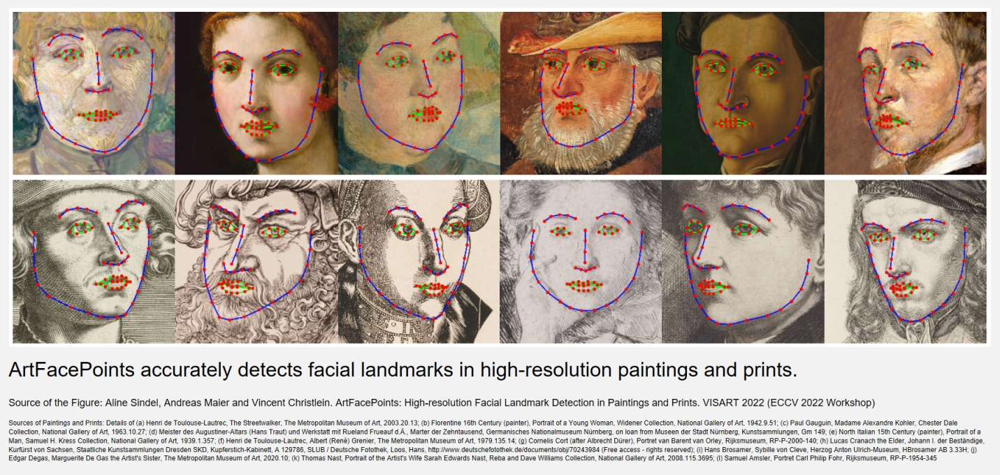

# ArtFacePoints: High-resolution Facial Landmark Detection in Paintings and Prints

This is the source code for our conference article "ArtFacePoints: High-resolution Facial Landmark Detection in Paintings and Prints" accepted at the VISART VI Workshop at the ECCV 2022.

If you use the code, please cite our [paper](https://arxiv.org/pdf/2210.09204)

	  @misc{Sindel2022ArtFacePoints,
		title={{ArtFacePoints: High-resolution Facial Landmark Detection in Paintings and Prints}},
		author={Aline Sindel and Andreas Maier and Vincent Christlein},
		year={2022},
		publisher = {arXiv},
		doi = {10.48550/ARXIV.2210.09204}
	  }

## Requirements

Install the requirements using pip or conda (python 3):
- torch (we used PyTorch 1.10. Cuda 11.3)
- torchvision
- opencv-contrib-python-headless
- numpy

## Usage

We provide the pre-trained model and the inference code to test ArtFacePoints for artwork images of size 1024 x 1024 which are cropped to the facial region.

### Pretrained weights

The pretrained weights of ArtFacePoints from the paper can be downloaded [here](https://drive.google.com/drive/folders/1GpgRXGjxtAKkvwkfQ8RpD7h9tP6beSP2?usp=sharing).

Move them into the folder: "/weights"

### ArtFacePoints Inference: 

Run detect_facial_landmarks_ArtFacePoints.py 

Some settings have to be specified, as described in the python file, such as the dataset and output folders and the model path.

### Landmark data format

The facial landmark predictions are saved in the .pts format (as used by [menpo](https://www.menpo.org/)):
68 2d coordinates (x,y) with Matlab indexing (1,1024), because we use menpo for online geometric data augmentation during training.   

## Acknowledgments
Code is partly based on:
- Encoder-decoder architecture based on the generator network of [CycleGAN-Pix2Pix](https://github.com/junyanz/pytorch-CycleGAN-and-pix2pix)
- [Soft-argmax](https://github.com/lext/deep-pipeline/blob/master/deeppipeline/keypoints/models/modules.py) 
- Geometric style augmentation for training adopted from [Face of Art](https://github.com/papulke/face-of-art)
- Artistic style transfer [AdaIN](https://arxiv.org/abs/1703.06868) using [AdaIN-pytorch](https://github.com/naoto0804/pytorch-AdaIN) and image-to-image translation using [CycleGAN](https://github.com/junyanz/pytorch-CycleGAN-and-pix2pix) to generate synthetic training data

@author Aline Sindel

